# projet-k8s-Olivieri-Alicia
**Auteur :**  Alicia OLIVIERI

**Date :** 25 Mars 2026

**Note sur la collaboration :** Projet réalisé individuellement, avec des sessions de co-working et d'entraide avec Lilo. (C'est la raison pour laquelle certains noms d'applications portent le préfixe "AL" pour Alicia/Lilo, bien que nos architectures finales soient distinctes).

---
# 1. Introduction et Choix du Framework
Pour répondre au besoin de scalabilité du client e-commerce, nous avons mis en place un **Proof of Concept (POC)** basé sur **Kubernetes**.

Le framework retenu pour ce projet est **Minikube**. Il s'agit de l'outil idéal pour un MVP (Minimum Viable Product) car il permet d'exécuter un cluster à nœud unique localement, tout en offrant l'accès aux fonctionnalités critiques de Kubernetes (HPA, Services, Secrets).

**Avantages** et **Inconvénients** de Minikube pour ce POC :

- Avantages : Simplicité d'installation, excellente isolation des environnements, et compatibilité native avec Docker.

- Inconvénients : Limité à un seul nœud (ne permet pas de tester la haute disponibilité matérielle réelle) et forte consommation de ressources (RAM/CPU) sur la machine hôte.

# 2. Architecture du projet (infra as code)
L'intégralité de l'infrastructure a été déployée selon l'approche "Infrastructure as Code" (IaC) via des manifestes YAML.

Plutôt que d'utiliser un fichier YAML monolithique regroupant toute l'infrastructure, j'ai fait le choix architectural de séparer les composants (un fichier par ressource/application). Ce choix se justifie pour trois raisons :

- Respect du cahier des charges : Il était explicitement demandé de développer un fichier IaC pour chaque application dans la partie 2.

- Lisibilité : La segmentation rend la navigation et la compréhension de l'architecture beaucoup plus simples.

- Maintenabilité et Sécurité : En cas de mise à jour ou de faille sur un composant, le fait d'avoir des fichiers isolés limite les risques d'erreurs de manipulation sur le reste de l'infrastructure.

### Namespaces : 
Afin d'isoler les ressources de manière logique, j'ai créé deux namespaces distincts :
- ```dev-al-25-03-2026``` 
- ```preprod-al-25-03-2026```.

### Applications : 
L'architecture repose sur trois applications principales : 
- 1. E-Commerce (Stripe) : Image personnalisée optimisée sur Docker Hub.
- 2. Caddy : Serveur web ultra-léger (image alpine).
- 3. Netdata : Outil d'observabilité pour le monitoring en temps réel.

### Réplication : 
Chaque application dispose de 3 réplicas pour garantir une disponibilité constante.

Voici deux représentations de l'architecture du projet (une vue conceptuelle globale et une vue orientée composants Kubernetes) :

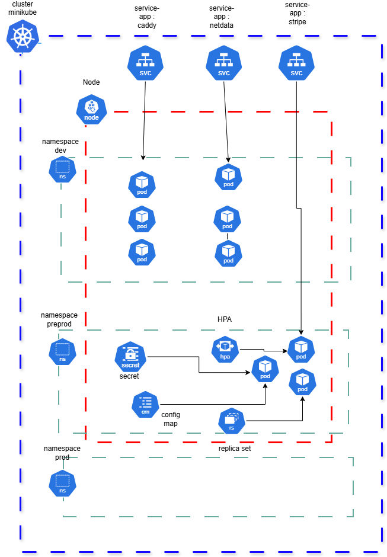


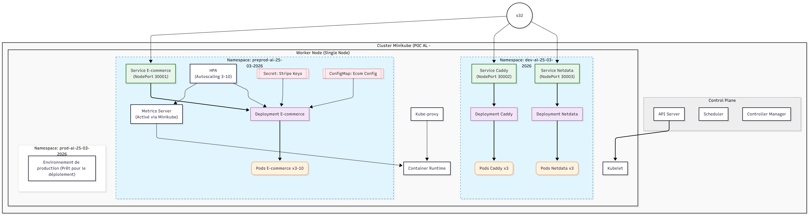

# 3. Initialisation du projet

## 3.1 Configuration de l'environnement Git et Minikube

La première étape a consisté à se connecter en SSH à la machine virtuelle via Visual Studio Code et à initialiser le dépôt Git relié à GitHub.

Ensuite, j'ai provisionné le cluster Minikube en lui allouant le maximum de ressources disponibles et en spécifiant la version de Kubernetes :

```minikube start --listen-address=0.0.0.0 --memory=max --cpus=max --kubernetes-version=v1.35.0```

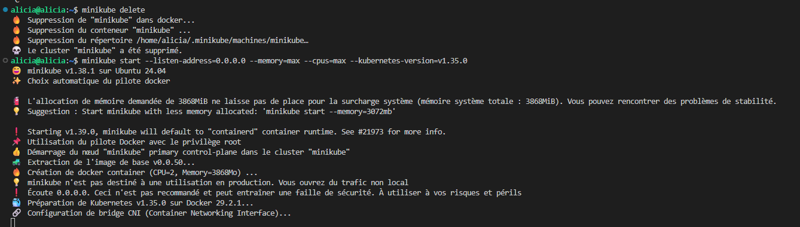

Pour pouvoir remonter des données de performance (nécessaires par la suite pour l'autoscaling), j'ai activé :

```minikube addons enable metrics-server```

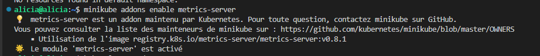

Enfin, j'ai récupéré et décompressé le code source de l'application e-commerce fourni.

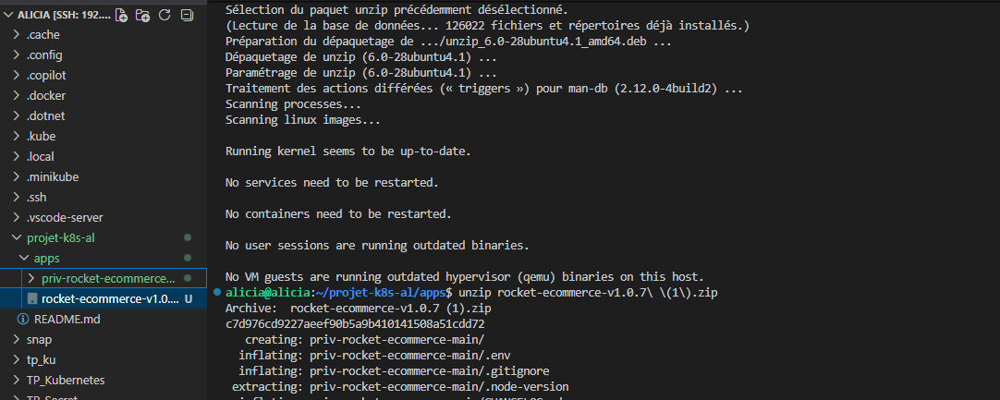


## 3.2 Stripe

Dans un souci d'optimisation et pour respecter la consigne exigeant des "applications les plus légères possible", j'ai modifié le **Dockerfile de l'application e-commerce pour utiliser une image de base **slim**.
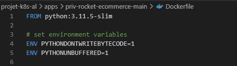

Afin d'éviter de devoir pousser l'image sur un registre externe (comme Docker Hub) pour chaque test local, j'ai lié le démon Docker de ma machine directement à celui de Minikube grâce à la commande suivante :


```eval $(minikube docker-env)```

Cette astuce permet à Minikube de trouver directement les images que je "build" localement. Je me suis ensuite authentifiée sur Docker.

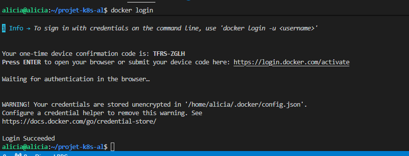
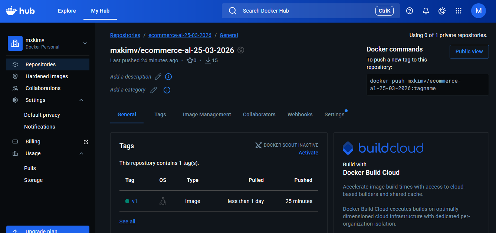

La configuration de l'application nécessitait des clés d'API que j'ai récupérées depuis le dashboard développeur de Stripe :

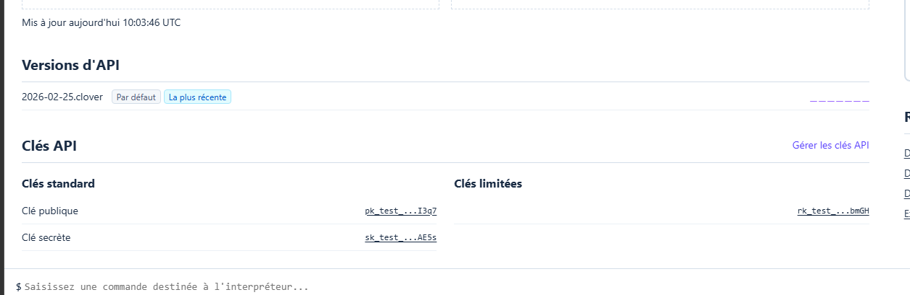

J'ai ensuite créé et appliqué le manifeste namespaces.yaml pour préparer mes environnements isolés.

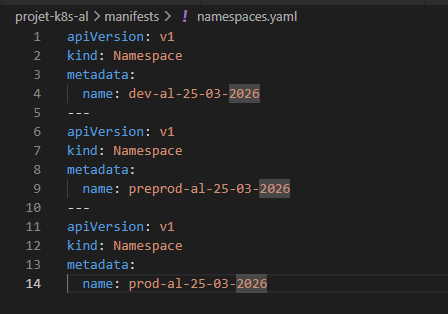


J'ai également créé et appliqué les manifest config.yaml, ecommerce-deployment et secret.yaml

Une fois les déploiements et services configurés (avec les ports adéquats pour l'exposition réseau), j'ai pu accéder avec succès à la page d'accueil de l'application e-commerce :

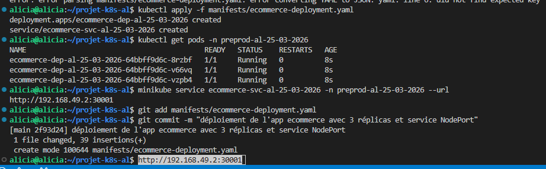

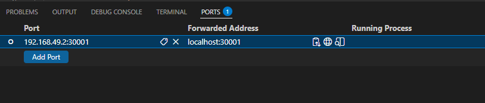

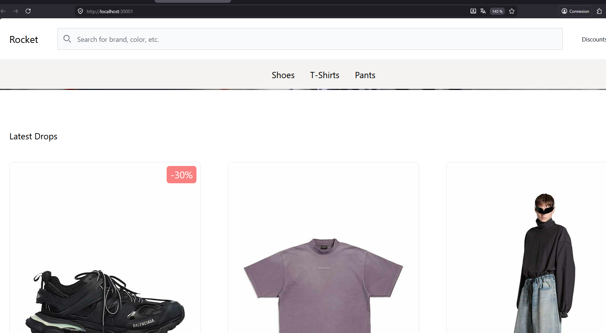


## 3.3 Applications Netdata & Caddy

Une fois l'application e-commerce en place, j'ai procédé au déploiement des deux autres services de l'infrastructure en rédigeant leurs manifestes respectifs : caddy-app.yaml et netdata-app.yaml.

- Caddy : Déployé en tant que serveur web léger (basé sur Alpine) pour garantir une consommation minimale de ressources.

- Netdata : Déployé pour assurer l'observabilité et le monitoring en temps réel de l'état du cluster.

Pour répondre aux exigences de haute disponibilité et de scalabilité, j'ai configuré un Horizontal Pod Autoscaler (HPA). Ce composant est crucial : il permet à l'application de s'adapter dynamiquement à la charge en créant automatiquement de nouveaux pods (réplicas) en cas de pic de trafic, et en les détruisant lorsque la charge diminue.

Pour que l'HPA puisse prendre ces décisions, il a besoin de connaître la consommation CPU et RAM des pods en temps réel. C'est pour cette raison que j'ai préalablement activé l'addon Minikube adéquat :

```minikube addons enable metrics-server```

Exposition des Services et Accès aux Interfaces
Afin de rendre ces applications accessibles depuis l'extérieur du cluster (sur ma machine hôte), j'ai configuré des objets de type Service dans mes manifestes YAML, en mappant les ports internes des conteneurs vers des ports accessibles.

Une fois les adresses et les ports correctement configurés, j'ai pu valider l'accès aux interfaces web de Caddy et au tableau de bord de Netdata :

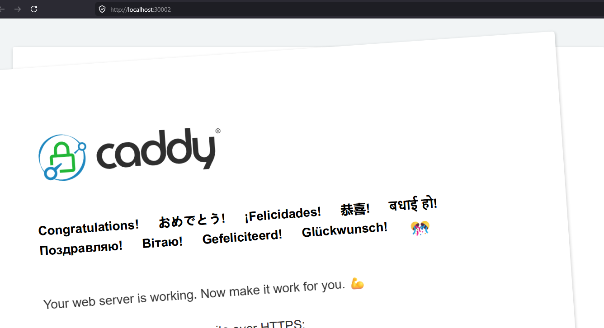

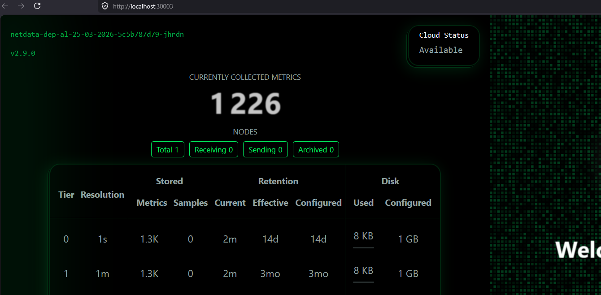

### Vérification de l'état du Cluster

Pour m'assurer que l'ensemble des ressources (Pods, Services, Deployments, ReplicaSets) s'exécutait correctement dans les bons environnements, j'ai utilisé l'interface en ligne de commande de Kubernetes (avec l'alias k pour kubectl).

Voici les commandes de vérification utilisées :

Lister toutes les ressources dans le namespace par défaut : 

```k get all```

Lister toutes les ressources spécifiquement dans le namespace de préproduction :

```k get all -n preprod-al-25-03-2026```

Filtrer et afficher toutes les ressources de tous les namespaces contenant le tag de mon projet :

```k get all -A | grep al-25-03-2026```

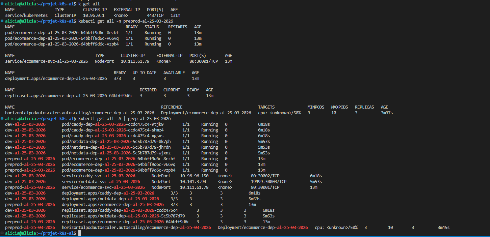

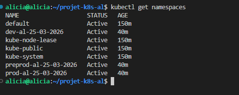

ConfigMaps :

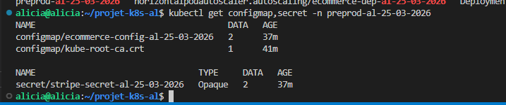

HPA : 

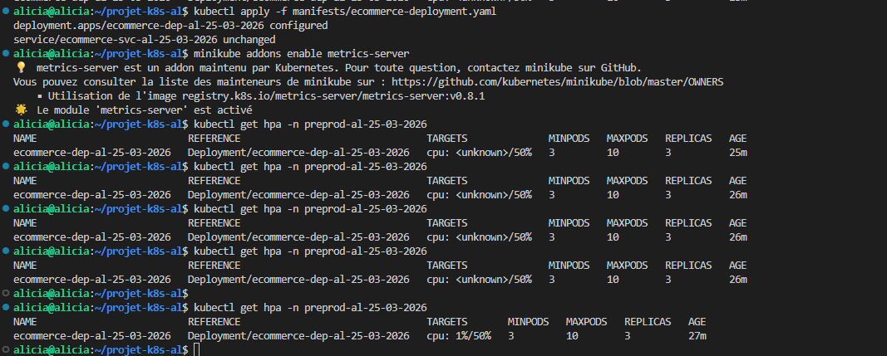

# 4. Sécurité et Gestion des Configurations

Conformément aux bonnes pratiques SRE (Site Reliability Engineering), une attention particulière a été portée à la séparation stricte entre le code de l'application et sa configuration.

Pour cela, j'ai utilisé les ressources natives de Kubernetes :

- ConfigMaps : Utilisés pour externaliser et gérer les variables d'environnement non sensibles (comme le mode Debug ou les URL de serveurs).

- Secrets : Indispensables pour le stockage sécurisé des informations critiques, comme les clés d'API Stripe. J'ai configuré ces objets en type Opaque avec l'attribut stringData, ce qui permet une injection sécurisée et chiffrée directement dans les Pods au moment de leur création.

De plus, l'utilisation d'images de type "slim" (comme vu précédemment pour l'application e-commerce) participe non seulement à l'optimisation des performances, mais réduit également considérablement la surface d'attaque potentielle de nos conteneurs.

# 5. Scalabilité et Cycle de Vie

Cette section met en lumière les capacités d'automatisation et de résilience de Kubernetes.

### Autoscaling dynamique (HPA)
Comme évoqué lors de l'activation du metrics-server, un Horizontal Pod Autoscaler (HPA) a été mis en place sur le déploiement de l'e-commerce. Il a été configuré avec des seuils précis : l'application "scale" automatiquement en passant de 3 à 10 pods dès que l'utilisation moyenne du CPU dépasse les 50%. Cela garantit que le site reste performant même lors de pics de trafic soudains.

### Mises à jour sans interruption (RollingUpdate)
Pour le cycle de vie de l'application, les mises à jour ont été configurées en utilisant la stratégie de déploiement RollingUpdate. Cette méthode permet de remplacer progressivement les anciens pods par les nouveaux, garantissant ainsi une mise à jour fluide avec zéro temps d'arrêt (Zero Downtime) pour les utilisateurs finaux.

### Tolérance aux pannes et Rollback
En cas d'erreur critique lors d'un nouveau déploiement (comme une image corrompue), l'architecture permet une récupération instantanée. Nous avons démontré la capacité du cluster à revenir immédiatement à la dernière version stable via la commande d'annulation native de Kubernetes :

kubectl rollout undo deployment/

### 6. Preuves de fonctionnement (Logs)

Afin d'auditer et de prouver le bon fonctionnement de l'infrastructure déployée, plusieurs extractions ont été réalisées. Les fichiers suivants sont joints au projet dans le dossier logs/ :

```history-projet-ALICIA-LILO.log``` : Trace complète de l'historique des commandes Linux utilisées lors de l'initialisation et de la configuration du projet.

```history-kubernetes-events-al-25-03-2026.log``` : Journal des événements du cluster, servant de preuve pour les succès de déploiements, l'affectation des ressources, et le déclenchement du scaling (HPA).
